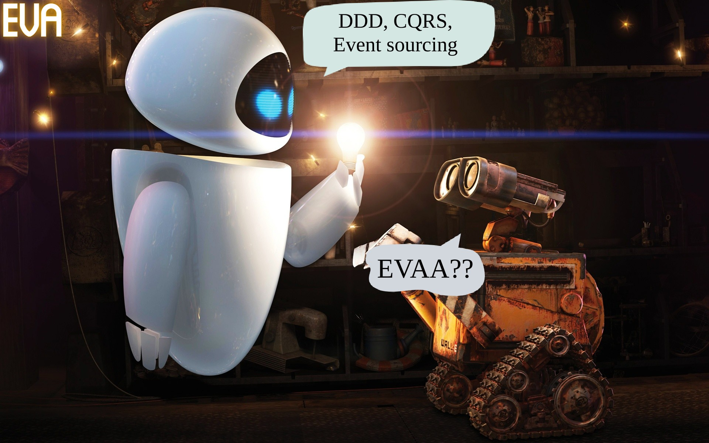

==========
[](https://github.com/razz-team/eva/actions)
[](https://search.maven.org/search?q=g:team.razz.eva%20OR%20g:team.razz.eva)

Welcome to Eva! It is a Kotlin open-source framework, which helps you to write your code in DDD style and using CQRS approach.


## Getting started

Declare Eva dependencies in your project:

```kotlin
dependencies {
    implementation("team.razz.eva:eva-uow:$eva_version")
    implementation("team.razz.eva:eva-repository:$eva_version")
    implementation("team.razz.eva:eva-persistence-jdbc:$eva_version")
}
```

### Model
Define events for your business domain.
You can read more about domain and integration events [here](https://docs.microsoft.com/en-us/dotnet/architecture/microservices/microservice-ddd-cqrs-patterns/domain-events-design-implementation). 
```kotlin
sealed class WalletEvent : ModelEvent<Wallet.Id> {

    override val modelName = "Wallet"

    data class Created(
        override val modelId: Wallet.Id,
        val currency: Currency,
        val amount: ULong
    ) : WalletEvent(), ModelCreatedEvent<Wallet.Id> {
        override fun integrationEvent() = buildJsonObject {
            put("currency", currency.currencyCode)
            put("amount", amount.toLong())
        }
    }

    data class Deposit(
        override val modelId: Wallet.Id,
        val walletAmount: ULong,
        val depositAmount: ULong
    ) : WalletEvent(), ModelCreatedEvent<Wallet.Id> {
        override fun integrationEvent() = buildJsonObject {
            put("walletAmount", walletAmount.toLong())
            put("depositAmount", depositAmount.toLong())
        }
    }
}
```

Define model and methods that changes model's state.
On any model's modification we should raise an event about it.
```kotlin
class Wallet constructor(
    id: Id,
    val currency: Currency,
    val amount: ULong,
    entityState: EntityState<Id, WalletEvent>
) : Model<Wallet.Id, WalletEvent>(id, entityState) {
    
    data class Id(override val id: UUID) : ModelId<UUID>
    
    fun deposit(toDeposit: ULong) = Wallet(
        amount = amount - toDeposit,
        currency = currency,
        id = id(),
        entityState = entityState()
            .raiseEvent(WalletEvent.Deposit(id(), amount, toDeposit))
    )
}
```

### Unit of work
Let's create queries interface, so we can query our existing models
```kotlin
interface WalletQueries {
    suspend fun find(id: Wallet.Id): Wallet?
}
```
Now we can write our first unit of work.
In our framework unit of work stands for Command in CQRS pattern.
You can read more about CQRS [here](https://docs.microsoft.com/en-us/azure/architecture/patterns/cqrs) and [here](https://martinfowler.com/bliki/CQRS.html).
Unit of work is a transactional operation.
In our example unit of work creates new model with provided id or returns an existing one.

```kotlin
class CreateWalletUow(
    private val queries: WalletQueries,
    clock: Clock
) : UnitOfWork<ServicePrincipal, Params, Wallet>(clock) {

    @Serializable
    data class Params(val id: String, val currency: String) : UowParams<Params> {
        override fun serialization() = serializer()
    }

    override suspend fun tryPerform(principal: ServicePrincipal, params: Params): Changes<Wallet> {
        val walletId = Wallet.Id(UUID.fromString(params.id))
        val wallet = queries.find(walletId)
        
        return if (wallet != null) {
            noChanges(wallet)
        } else {
            val amount = ULong.MIN_VALUE
            val currency = Currency.getInstance(params.currency)
            val newWallet = Wallet(
                id = walletId,
                currency = currency,
                amount = amount,
                entityState = newState(WalletEvent.Created(walletId, currency, amount))
            )
            changes {
                add(newWallet)
            }
        }
    }
}
```
In this example we return noChanges in case model with such id already exists, otherwise we create new model and using ChangesDsl we **add** new model.


You can also update your models in scope of unit of work - 
```kotlin
    changes {
        update(wallet.deposit(amount))    
    }
```
By default, **update** allows passing model with no changes (model was not updated after calling *deposit()* method).
Sometimes it can lead to some inconsistency in your domain logic - you expected model to be changed, but it wasn't.
You can force verification for your model, that it was changed in scope of your unit of work:
```kotlin
    changes {
        update(wallet.deposit(amount), required = true)    
    }
```

### Repository
To persist our model we need to add repository for it.
We use [jOOQ](https://www.jooq.org/) to have a type-safe DB querying.
You need to generate jOOQ tables/records based on your DB schema to have a type-safe mapping of your model to DB record.
You can use different Gradle plugins to generate jOOQ tables, f.e. check this [plugin](https://github.com/etiennestuder/gradle-jooq-plugin). 

When you create tables for your models you need to add next fields to your schema, so we can persist your model properly - 
```sql
  record_updated_at         TIMESTAMP      NOT NULL            ,
  record_created_at         TIMESTAMP      NOT NULL            ,
  version                   BIGINT         NOT NULL
```

After you created DB schema for you data, we can implement Repository for your model.
```kotlin
class WalletRepository(
    queryExecutor: QueryExecutor,
    dslContext: DSLContext
) : WalletQueries, JooqBaseModelRepository<UUID, Wallet.Id, Wallet, WalletEvent, WalletRecord>(
    queryExecutor = queryExecutor,
    dslContext = dslContext,
    table = Tables.WALLET
) {
    override fun toRecord(model: Wallet) = WalletRecord().apply {
        currency = model.currency.currencyCode
        amount = model.amount.toLong()
    }

    override fun fromRecord(
        record: WalletRecord,
        entityState: PersistentState<Wallet.Id, WalletEvent>
    ) = Wallet(
        id = Wallet.Id(record.id),
        currency = Currency.getInstance(record.currency),
        amount = record.amount.toULong(),
        entityState = entityState
    )
}
```

### Configure it
We have unit of work and repository, so we can set up everything together.
In this example we are going to use JDBC implementation for our transactional manager.
```kotlin
class WalletModule(databaseConfig: DatabaseConfig) {

    /**
     * Query executor definition
     */
    val transactionManager = JdbcTransactionManager(
        primaryProvider = HikariPoolConnectionProvider(dataSource(databaseConfig, isPrimary = true)),
        replicaProvider = HikariPoolConnectionProvider(dataSource(databaseConfig, isPrimary = false)),
        blockingJdbcContext = newFixedThreadPool(databaseConfig.maxPoolSize.value()).asCoroutineDispatcher()
    )
    val queryExecutor = JdbcQueryExecutor(transactionManager)
    val dslContext: DSLContext = DSL.using(
        POSTGRES,
        Settings().withRenderNamedParamPrefix("$").withParamType(ParamType.NAMED)
    )

    /**
     * Persisting definition
     */
    val tracer = NoopTracerFactory.create()
    val walletRepo = WalletRepository(queryExecutor, dslContext)
    val persisting = Persisting(
        transactionManager = transactionManager,
        modelRepos = ModelRepos(Wallet::class hasRepo walletRepo),
        eventRepository = JooqEventRepository(queryExecutor, dslContext, tracer)
    )

    /**
     * Unit of work executor definition
     */
    val clock = Clock.tickMillis(UTC)
    val uowx: UnitOfWorkExecutor = UnitOfWorkExecutor(
        persisting = persisting,
        tracer = tracer,
        meterRegistry = SimpleMeterRegistry(),
        factories = listOf(
            CreateWalletUow::class withFactory { CreateWalletUow(walletRepo, clock) }
        )
    )
}
```

### Run it!
> Please don't forget to create tables for your models and table for storing events.
You can find script to create event's table [here](eva-events-db-schema/src/main/resources/com/razz/eva/events/db)

```kotlin
    val module = WalletModule(config)
    val principal = ServicePrincipal(Principal.Id("eva-id"), Principal.Name("eva"))
    
    val createdWallet = module.uowx.execute(CreateWalletUow::class, principal) {
        CreateWalletUow.Params(
            id = "45dfd599-4d62-47f1-8e47-a779df4f6bbc",
            currency = "USD"
        )
    }
```

## Features

### Event sourcing
...

### Unit of work validation
After you wrote your first unit of work, you probably want to ask - how I can test it?

We provide verification DSL, so you can write unit tests and verify results of your unit of work.
Use `verifyInOrder` function to start verification process.
```kotlin
    CreateWalletUow(queries, clock).tryPerform(principal, params) verifyInOrder {
        adds<Wallet> { model -> ... }
        addsEq(expectedModel)
        
        updates<Wallet> { model -> ... }
        updatesEq(expectedModel)

        emits<WalletEvent> { event -> ... }
        emitsEq(expectedEvent)
    
        returns { result -> ... }
    }
```
You can check some examples [here](eva-uow/src/test/kotlin/com/razz/eva/uow/UnitOfWorkDemoSpec.kt)

### Idempotency

### Paging

### Error handling
One day you are going face a lot of concurrent unit of works.
It leads to concurrent modification of same models. But our units of work are transactional, so we guarantee consistency of your models.
In case of concurrent modification unit of work throws [StaleRecordException](eva-persistence/src/main/kotlin/com/razz/eva/persistence/PersistenceException.kt).
By default, we will do a one retry for such kind of exception, but you can change this strategy
```kotlin
val configuration = UnitOfWork.Configuration(
    retry = StaleRecordFixedRetry(attempts = 3, staleRecordDelay = Duration.ofMillis(100))
)

class CreateWalletUow(
    private val queries: WalletQueries,
    clock: Clock
) : UnitOfWork<ServicePrincipal, Params, Wallet>(clock, configuration = configuration) {
```

Your database schema can also have some constraints, f.e. unique index. We don't want you to deal with such kind of exception out of your unit of work.
You can intercept these exceptions and throw your business exception or return some fallback result.

In our `CreateWalletUow` we check if wallet with same id already exists.
But we can face situation, when wallet with same id was created during unit of work execution.
Let's intercept this error and return already created wallet. We also can handle DB constraint and throw some more meaningful exception.

```kotlin
override suspend fun onFailure(params: Params, ex: PersistenceException): Wallet = when(ex) {
    is UniqueModelRecordViolationException -> checkNotNull(queries.find(Wallet.Id(UUID.fromString(params.id))))
    is ModelRecordConstraintViolationException -> throw IllegalArgumentException("${params.currency} is invalid")
    else -> throw ex
}
```

### Tracing and Monitoring
If you care about your system performance - you want to collect some metrics, so you can create alerts and investigate poor performance.
We allow you to collect some metrics via [Micrometer framework](https://micrometer.io/) and do instrumentation with [Opentracing](https://opentracing.io/).
Both frameworks provide you interfaces, and you can choose your own implementation, how you want to collect metrics.
In this example we use [Prometheus](https://prometheus.io/) and [Jaeger](https://www.jaegertracing.io/) implementations.
> Don't forget to add Jaeger and Prometheus dependencies to your project
```kotlin
    val meterRegistry = PrometheusMeterRegistry(DEFAULT)

    val uowx: UnitOfWorkExecutor = UnitOfWorkExecutor(
        persisting = persisting,
        tracer = tracer("wallet-service"),
        meterRegistry = meterRegistry,
        factories = listOf(
            CreateWalletUow::class withFactory { CreateWalletUow(walletRepo, clock) }
        )
    )
```

### Async persistence


# License
Eva is distributed under the terms of the Apache License (Version 2.0). See [license file](LICENSE) for details.
