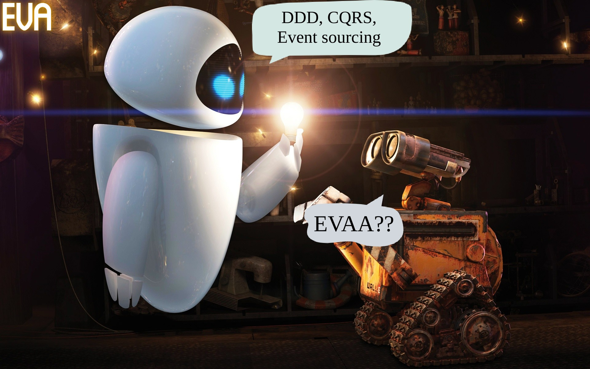

==========
[](https://github.com/razz-team/eva/actions)
[](https://search.maven.org/search?q=g:team.razz.eva%20OR%20g:team.razz.eva)

Welcome to Eva! It is a Kotlin open-source framework that helps you write your code in DDD style using the CQRS approach.


## Getting started

Declare Eva dependencies in your project:

```kotlin
dependencies {
    implementation("team.razz.eva:eva-uow:$eva_version")
    implementation("team.razz.eva:eva-repository:$eva_version")
    implementation("team.razz.eva:eva-persistence-jdbc:$eva_version")

    // params serialization - pick one:
    implementation("team.razz.eva:eva-uow-params-kotlinx:$eva_version") // kotlinx.serialization
    // implementation("team.razz.eva:eva-uow-params-jackson:$eva_version") // jackson
}
```

For snapshot versions you also need to add the Sonatype snapshots repository:
```kotlin
repositories {
    maven { url = URI.create("https://central.sonatype.com/repository/maven-snapshots/") }
}
```

### Model
Define events for your business domain.
You can read more about domain and integration events [here](https://docs.microsoft.com/en-us/dotnet/architecture/microservices/microservice-ddd-cqrs-patterns/domain-events-design-implementation). 
```kotlin
sealed class WalletEvent : ModelEvent<Wallet.Id> {

    override val modelName = "Wallet"

    data class Created(
        override val modelId: Wallet.Id,
        val currency: Currency,
        val amount: ULong,
        val expireAt: Instant,
    ) : WalletEvent(), ModelCreatedEvent<Wallet.Id> {
        override fun integrationEvent() = buildJsonObject {
            put("currency", currency.currencyCode)
            put("amount", amount.toLong())
            put("expireAt", expireAt.epochSecond)
        }
    }

    data class Deposit(
        override val modelId: Wallet.Id,
        val walletAmount: ULong,
        val depositAmount: ULong,
    ) : WalletEvent(), ModelCreatedEvent<Wallet.Id> {
        override fun integrationEvent() = buildJsonObject {
            put("walletAmount", walletAmount.toLong())
            put("depositAmount", depositAmount.toLong())
        }
    }
}
```

Define a model and methods that change its state.
On any modification we should raise a corresponding event.
```kotlin
class Wallet(
    id: Id,
    val currency: Currency,
    val amount: ULong,
    val expireAt: Instant,
    modelState: ModelState<Id, WalletEvent>,
) : Model<Wallet.Id, WalletEvent>(id, modelState) {

    data class Id(override val id: UUID) : ModelId<UUID>

    fun deposit(toDeposit: ULong) = Wallet(
        amount = amount - toDeposit,
        currency = currency,
        id = id(),
        expireAt = expireAt,
        modelState = modelState()
            .raiseEvent(WalletEvent.Deposit(id(), amount, toDeposit))
    )
}
```

### Aggregate
When a model is an aggregate root that owns child models, extend `Aggregate` instead of `Model`. Child models are carried by the aggregate and automatically persisted alongside it in the same transaction.

```kotlin
class Invoice(
    id: Id,
    val state: State,
    val totalAmount: Money,
    val lineItems: List<LineItem>,
    modelState: ModelState<Id, Event>,
) : Aggregate<Invoice.Id, Event>(id, modelState, lineItems) {

    data class Id(override val id: UUID) : ModelId<UUID>

    fun addLineItem(lineItem: LineItem): Invoice = copy(
        totalAmount = totalAmount + lineItem.amount,
        lineItems = lineItems + lineItem,
        modelState = raiseEvent(LineItemAdded(id(), lineItem.id(), lineItem.amount)),
    )
}
```

The third parameter to `Aggregate` is the list of owned child models. When you `add` or `update` an aggregate through a unit of work, Eva automatically flattens owned children into separate `add`/`update` changes -- new children are inserted, dirty children are updated, and unchanged children are skipped.

Aggregate repositories extend `JooqAggregateRepository` and implement a three-argument `fromRecord`:
```kotlin
class InvoiceRepository(
    queryExecutor: QueryExecutor,
    dslContext: DSLContext,
) : JooqAggregateRepository<UUID, Invoice.Id, Invoice, Event, InvoiceRecord>(
    queryExecutor = queryExecutor,
    dslContext = dslContext,
    table = INVOICE,
    ownedModelSpecs = listOf(lineItemSpec),
) {
    override fun toRecord(model: Invoice) = InvoiceRecord().apply { ... }

    override fun fromRecord(
        record: InvoiceRecord,
        modelState: PersistentState<Invoice.Id, Event>,
        ownedModels: List<Model<*, *>>,
    ) = Invoice(
        id = Invoice.Id(record.id),
        lineItems = ownedModels.filterIsInstance<LineItem>(),
        modelState = modelState,
        ...
    )
}
```

The `ownedModelSpecs` parameter defines how to load children when reading aggregates from the database. Each `OwnedModelSpec` loads children for a batch of parent aggregates.

### Entity
While Models are the primary building blocks for your domain, sometimes you need simpler data structures that don't require full lifecycle management. Entities serve this purpose.

```kotlin
data class Tag(
    val subjectId: UUID,
    val name: String,
    val value: String,
) : DeletableEntity()
```

Entities can be added and deleted within the same Unit of Work as Models:
```kotlin
override suspend fun tryPerform(principal: ServicePrincipal, params: Params): Changes<Unit> {
    return changes {
        update(department.addEmployee(employee))
        add(Tag(department.id().id, "employee-added", employee.id().toString()))
    }
}
```

Entity repositories extend `JooqBaseEntityRepository` or `JooqDeletableEntityRepository`:
```kotlin
class TagRepository(
    queryExecutor: QueryExecutor,
    dslContext: DSLContext,
) : JooqDeletableEntityRepository<Tag, TagRecord>(queryExecutor, dslContext, TAG) {
    
    override fun toRecord(entity: Tag): TagRecord = TagRecord().apply {
        subjectId = entity.subjectId
        name = entity.name
        value = entity.value
    }

    override fun fromRecord(record: TagRecord): Tag = Tag(
        subjectId = record.subjectId,
        name = record.name,
        value = record.value,
    )

    override fun entityCondition(entity: Tag): Condition =
        TAG.SUBJECT_ID.eq(entity.subjectId)
            .and(TAG.NAME.eq(entity.name))
}
```

Configure entity repositories alongside model repositories:
```kotlin
val persisting = Persisting(
    transactionManager = transactionManager,
    modelRepos = ModelRepos(Wallet::class hasRepo walletRepo),
    entityRepos = EntityRepos(Tag::class hasEntityRepo tagRepo),
    eventRepository = eventRepository,
    paramsSerializer = KotlinxParamsSerializer(),
)
```

### Unit of work
We need a *queries* interface so we can query our existing models
```kotlin
interface WalletQueries {
    suspend fun find(id: Wallet.Id): Wallet?
}
```
Now we can write our first unit of work.
In our framework, a unit of work stands for a command in the CQRS pattern.
You can read more about CQRS [here](https://docs.microsoft.com/en-us/azure/architecture/patterns/cqrs) and [here](https://martinfowler.com/bliki/CQRS.html).
A unit of work is a transactional operation.
Here the unit of work either returns an existing wallet by id or creates a new one and returns it.

```kotlin
class CreateWalletUow(
    private val queries: WalletQueries,
    executionContext: ExecutionContext,
) : UnitOfWork<ServicePrincipal, Params, Wallet>(executionContext) {

    @Serializable
    data class Params(val id: String, val currency: String) : UowParams<Params>

    override suspend fun tryPerform(principal: ServicePrincipal, params: Params): Changes<Wallet> {
        val walletId = Wallet.Id(UUID.fromString(params.id))
        val wallet = queries.find(walletId)

        return if (wallet != null) {
            noChanges(wallet)
        } else {
            val amount = ULong.MIN_VALUE
            val currency = Currency.getInstance(params.currency)
            val expireAt = clock.instant().plus(timeToExpire)
            val newWallet = Wallet(
                id = walletId,
                currency = currency,
                amount = amount,
                expireAt = expireAt,
                modelState = newState(WalletEvent.Created(walletId, currency, amount, expireAt)),
            )
            changes {
                add(newWallet)
            }
        }
    }

    companion object {
        private val timeToExpire = Duration.ofDays(600)
    }
}
```
Here `UowParams` is `com.razz.eva.uow.params.kotlinx.UowParams` - see [Params Serialization](#params-serialization) for details on wiring up serialization.

In this example we return `noChanges` in case a model with this id already exists, otherwise we create a new model and using `ChangesDsl` we **add** it.


You can also update your models within a unit of work:
```kotlin
    changes {
        update(wallet.deposit(amount))    
    }
```
By default, **update** allows passing a model with no changes (the model was not updated after calling *deposit()*).
Sometimes this can lead to inconsistency in your domain logic - you expected the model to be changed, but it wasn't.
You can verify that the model was actually changed within the unit of work:
```kotlin
    changes {
        update(wallet.deposit(amount), required = true)    
    }
```

### Repository
To persist our model we need to add a repository for it.
We use [jOOQ](https://www.jooq.org/) to have a type-safe DB querying.
You need to generate jOOQ tables/records based on your DB schema to have a type-safe mapping of your model to DB record.
You can use different Gradle plugins to generate jOOQ tables, e.g. check this [plugin](https://github.com/etiennestuder/gradle-jooq-plugin).

Your generated records should extend [BaseModelRecord](eva-jooq/src/main/kotlin/com/razz/jooq/record/BaseModelRecord.kt).
To achieve it use [jOOQ matcher strategies](https://www.jooq.org/doc/latest/manual/code-generation/codegen-matcherstrategy/).

When you create tables for your models you need to add the following fields to your schema, so we can persist your model properly:
```sql
  record_updated_at         TIMESTAMP      NOT NULL            ,
  record_created_at         TIMESTAMP      NOT NULL            ,
  version                   BIGINT         NOT NULL
```

After you have created the DB schema for your data, we can implement a repository for your model.
```kotlin
class WalletRepository(
    queryExecutor: QueryExecutor,
    dslContext: DSLContext,
) : WalletQueries, JooqBaseModelRepository<UUID, Wallet.Id, Wallet, WalletEvent, WalletRecord>(
    queryExecutor = queryExecutor,
    dslContext = dslContext,
    table = WALLET,
) {
    override fun toRecord(model: Wallet) = WalletRecord().apply {
        currency = model.currency.currencyCode
        amount = model.amount.toLong()
        expireAt = model.expireAt
    }

    override fun fromRecord(
        record: WalletRecord,
        modelState: PersistentState<Wallet.Id, WalletEvent>,
    ) = Wallet(
        id = Wallet.Id(record.id),
        currency = Currency.getInstance(record.currency),
        amount = record.amount.toULong(),
        expireAt = record.expireAt,
        modelState = modelState,
    )
}
```

### Configure it
We have unit of work and repository, so we can set up everything together.
In this example we are going to use JDBC implementation for our transactional manager.
```kotlin
class WalletModule(databaseConfig: DatabaseConfig) {

    /**
     * Query executor definition
     */
    val primaryMaxPoolSize = databaseConfig.maxPoolSize.value() // in this example primary and replica have the same size
    val replicaMaxPoolSize = databaseConfig.maxPoolSize.value()

    // dispatcher must have at least primary+replica number of threads, otherwise it will cause deadlocks
    val dispatcher = newFixedThreadPool(primaryMaxPoolSize + replicaMaxPoolSize).asCoroutineDispatcher()
    val transactionManager = JdbcTransactionManager(
        primaryProvider = DataSourceConnectionProvider(
            pool = dataSource(databaseConfig, isPrimary = true),
            blockingJdbcContext = dispatcher,
            poolMaxSize = primaryMaxPoolSize
        ),
        replicaProvider = DataSourceConnectionProvider(
            pool = dataSource(databaseConfig, isPrimary = false),
            blockingJdbcContext = dispatcher,
            poolMaxSize = replicaMaxPoolSize
        ),
        blockingJdbcContext = dispatcher,
    )
    val queryExecutor = JdbcQueryExecutor(transactionManager)
    val dslContext: DSLContext = DSL.using(
        POSTGRES,
        Settings().withRenderNamedParamPrefix("$").withParamType(ParamType.NAMED),
    )

    /**
     * Persisting definition
     */
    val walletRepo = WalletRepository(queryExecutor, dslContext)
    val persisting = Persisting(
        transactionManager = transactionManager,
        modelRepos = ModelRepos(Wallet::class hasRepo walletRepo),
        entityRepos = EntityRepos(),
        eventRepository = JooqEventRepository(queryExecutor, dslContext, noop()),
        paramsSerializer = KotlinxParamsSerializer(),
    )

    /**
     * Unit of work executor definition
     */
    val clock = Clock.tickMillis(UTC)
    val uowx: UnitOfWorkExecutor = UnitOfWorkExecutor(
        persisting = persisting,
        openTelemetry = noop(),
        clock = clock,
        factories = listOf(
            CreateWalletUow::class withFactory { executionContext -> CreateWalletUow(walletRepo, executionContext) },
        ),
    )
}
```

### Run it!
> Please don't forget to create tables for your models and table for storing events.
You can find the script to create the events table [here](eva-events-db-schema/src/main/resources/com/razz/eva/events/db)

```kotlin
    val module = WalletModule(config)
    val principal = ServicePrincipal(Principal.Id("eva-id"), Principal.Name("eva"))
    
    val createdWallet = module.uowx.execute(CreateWalletUow::class, principal) {
        CreateWalletUow.Params(
            id = "45dfd599-4d62-47f1-8e47-a779df4f6bbc",
            currency = "USD",
        )
    }
```

## Design Philosophy

### Model vs Entity: When to Use Which

Eva provides two fundamental building blocks for your domain: **Models** and **Entities**. Understanding when to use each is crucial for clean domain design.

#### Use Model when:
- The object has a **distinct identity** that persists over time (e.g., User, Order, Wallet)
- You need to track **state changes** and emit **domain events**
- The object has a **lifecycle** with meaningful state transitions

#### Use Aggregate when:
- The object is an **aggregate root** in DDD terms
- It **owns child models** that should be persisted alongside it (e.g., Invoice with LineItems)
- Children are loaded together with the parent and don't exist independently

#### Use Entity when:
- The object's identity is defined by its **content/attributes** rather than a separate Id
- You need simple **add/delete** operations without lifecycle management
- The object represents **supplementary data** like tags, labels, allocations, or mappings
- No domain events need to be emitted for changes
- The object is essentially a **value object that needs persistence**

#### Key Differences

| Aspect | Model | Aggregate | Entity |
|--------|-------|-----------|--------|
| Identity | Explicit ID field (`ModelId`) | Explicit ID field (`ModelId`) | Implicit, defined by content |
| Versioning | Yes (optimistic locking) | Yes (optimistic locking) | No |
| Events | Emits `ModelEvent` on state changes | Emits `ModelEvent` on state changes | No events |
| Owned children | No | Yes, via `ownedModels` | No |
| Operations | `add`, `update`, `notChanged` | `add`, `update`, `notChanged` | `add`, `delete` |
| Typical use | Core domain objects | Aggregate roots with children | Tags, labels, mappings |

#### Example Decision

Consider a `Department` with employees and tags:

```kotlin
// Aggregate: Aggregate root that owns child Employee models
class Department(
    id: Id,
    val name: String,
    val headcount: Int,
    val employees: List<Employee>,
    modelState: ModelState<Id, DepartmentEvent>,
) : Aggregate<Department.Id, DepartmentEvent>(id, modelState, employees) {

    fun addEmployee(employee: Employee) = Department(
        id = id(), name = name, headcount = headcount + 1,
        employees = employees + employee,
        modelState = raiseEvent(EmployeeAdded(id(), employee.id(), headcount + 1)),
    )
}

// Model: Has identity, lifecycle, emits events, but no children
class Employee(
    id: Id,
    val name: String,
    modelState: ModelState<Id, EmployeeEvent>,
) : Model<Employee.Id, EmployeeEvent>(id, modelState)

// Entity: Identity is (subjectId + name), no lifecycle, no events
data class Tag(
    val subjectId: UUID,
    val name: String,
    val value: String,
) : DeletableEntity()
```

The `Department` is an Aggregate because it's an aggregate root that owns child `Employee` models. The `Employee` is a Model because it has identity and lifecycle but doesn't own children. The `Tag` is an Entity because it's supplementary data whose identity is fully determined by its attributes.

### Implementation Details

#### Type Hierarchy
Models and Entities have **independent type hierarchies**. Both `Model` and `Entity` are abstract classes, which prevents a class from extending both:

```
Model<ID, E> (abstract class)
  ├── Aggregate<ID, E> (abstract class) -- owns child models
  └── Your domain models

Entity (abstract class)
  └── CreatableEntity (abstract class)
        └── DeletableEntity (abstract class)
              └── Your deletable entities
```

#### Entity Classes
- `CreatableEntity`: Can be added via `add()` in ChangesDsl
- `DeletableEntity`: Extends `CreatableEntity`, can also be deleted via `delete()` in ChangesDsl

Use `CreatableEntity` for append-only data (audit logs, historical records). Use `DeletableEntity` when entities can be removed.

#### Repository Pattern
Entity repositories follow the same pattern as Model repositories but without versioning:

```kotlin
// For entities that can only be added
interface EntityRepository<E : CreatableEntity> {
    suspend fun add(context: TransactionalContext, entity: E): E
    suspend fun add(context: TransactionalContext, entities: List<E>): List<E>
}

// For entities that can be added and deleted
interface DeletableEntityRepository<E : DeletableEntity> : EntityRepository<E> {
    suspend fun delete(context: TransactionalContext, entity: E): Boolean
    suspend fun delete(context: TransactionalContext, entities: List<E>): Int
}
```

#### Database Schema
Entity tables don't require `version` column but still need timestamp tracking:
```sql
CREATE TABLE tag (
    subject_id      UUID        NOT NULL,
    name            VARCHAR     NOT NULL,
    value           VARCHAR     NOT NULL,
    record_created_at TIMESTAMP NOT NULL,
    record_updated_at TIMESTAMP NOT NULL,
    PRIMARY KEY (subject_id, name)
);
```

#### Transactional Consistency
Models and Entities are persisted in the **same transaction**, ensuring consistency:

```kotlin
changes {
    update(department.addEmployee(employee))      // Model update
    add(Tag.tag(department.id().id, "new-hire", employee.name))  // Entity add
    delete(oldTag)                                 // Entity delete
}
// All changes committed atomically
```

## Features

### Params Serialization

Every unit of work declares a `Params` class that gets serialized and stored alongside the event. Eva supports pluggable serialization via the `ParamsSerializer` interface. Two implementations are provided out of the box.

#### Kotlinx Serialization (recommended)

```kotlin
dependencies {
    implementation("team.razz.eva:eva-uow-params-kotlinx:$eva_version")
}
```

Params classes extend `com.razz.eva.uow.params.kotlinx.UowParams` and are annotated with `@Serializable`:
```kotlin
@Serializable
data class Params(val id: String, val currency: String) : UowParams<Params> {
    override fun serialization() = serializer()
}
```

The `serialization()` override is required by the `UowParams` interface - it bridges your params class with the kotlinx serialization `serializer()` generated by the `@Serializable` annotation.

Optionally, you can apply the `eva-uow-params-kotlinx-compiler` K2 compiler plugin to auto-generate this override, so you can omit it:
```kotlin
// build.gradle.kts
apply<EvaUowParamsKotlinxCompilerPlugin>()
```
```kotlin
// now the override is generated automatically
@Serializable
data class Params(val id: String, val currency: String) : UowParams<Params>
```

Wire the serializer when constructing `Persisting`:
```kotlin
val persisting = Persisting(
    // ...
    paramsSerializer = KotlinxParamsSerializer(),
)
```

> **IntelliJ IDEA note:** IDEA K2 mode only loads bundled compiler plugins by default, so it may show
> "does not implement abstract member `serialization()`" errors even though the build succeeds.
> To fix this, open **Help -> Find Action -> Registry** and set
> `kotlin.k2.only.bundled.compiler.plugins.enabled` to `false`, then re-sync the Gradle project.

#### Jackson

```kotlin
dependencies {
    implementation("team.razz.eva:eva-uow-params-jackson:$eva_version")
}
```

Params classes extend the base `com.razz.eva.uow.UowParams` directly - no annotations or compiler plugins needed:
```kotlin
data class Params(val walletId: String, val amount: Long) : UowParams<Params>
```

Wire the serializer:
```kotlin
val persisting = Persisting(
    // ...
    paramsSerializer = JacksonParamsSerializer(), // uses jacksonObjectMapper() by default
)
```

You can pass a custom `ObjectMapper` if needed:
```kotlin
val persisting = Persisting(
    // ...
    paramsSerializer = JacksonParamsSerializer(myObjectMapper),
)
```

### Composable Unit of Work

When a business operation spans multiple bounded contexts, you can compose units of work together. A parent UoW orchestrates child UoWs, and all changes are collected into a single transaction.

Extend `com.razz.eva.uow.composable.UnitOfWork` instead of the regular `UnitOfWork` and use the `execute` function to invoke child UoWs:

```kotlin
class CheckoutUow(
    private val cartQueries: (Cart.Id) -> Cart,
    private val accountQueries: (Account.Id) -> Account,
    private val inventoryQueries: (Inventory.Id) -> Inventory,
    executionContext: ExecutionContext,
) : UnitOfWork<ServicePrincipal, Params, Cart.Id>(executionContext) {

    @Serializable
    data class Params(
        val cartId: Cart.Id,
        val accountId: Account.Id,
        val inventoryId: Inventory.Id,
    ) : UowParams<Params>

    override suspend fun tryPerform(principal: ServicePrincipal, params: Params) = changes {
        val cart = cartQueries(params.cartId)
        var totalAmount = 0L
        cart.items.forEach { item -> totalAmount += item.price }

        val accountId = execute({ DebitAccountUow(accountQueries, it) }, principal) {
            DebitAccountUow.Params(params.accountId, totalAmount)
        }
        execute({ ReduceInventoryUow(inventoryQueries, it) }, principal) {
            ReduceInventoryUow.Params(params.inventoryId, items)
        }
        update(cart.checkout(accountId)).id()
    }
}
```

The `execute` function takes a UoW factory, a principal, and params. Child UoWs inherit accumulated changes from the parent, and their changes are merged back. All changes from parent and child UoWs are persisted in a single transaction.

Child UoWs must also extend `com.razz.eva.uow.composable.UnitOfWork`:

```kotlin
class DebitAccountUow(
    private val accountQueries: (Account.Id) -> Account,
    executionContext: ExecutionContext,
) : UnitOfWork<ServicePrincipal, Params, Account.Id>(executionContext) {

    @Serializable
    data class Params(
        val accountId: Account.Id,
        val amount: Long,
    ) : UowParams<Params>

    override suspend fun tryPerform(principal: ServicePrincipal, params: Params) = changes {
        val account = accountQueries(params.accountId)
        update(account.debit(params.amount)).id()
    }
}
```

### Event sourcing

#### Transactional outbox 
Eva employs the [outbox pattern](https://microservices.io/patterns/data/transactional-outbox.html) for event distribution. In short: events are written to the same database and in the same transaction as models. The same transactional guarantees apply to both models and events. The events schema and migrations are provided by Eva - you can find SQL sources [here](/eva-events-db-schema/src/main/resources/com/razz/eva/events/db/V001__create_events.sql) and persistence logic [here](eva-repository/src/main/kotlin/com/razz/eva/repository/JooqEventRepository.kt). Eva is not in charge of further distribution of such events; however, there are several open-source frameworks available, for instance [Kafka Connect](https://docs.confluent.io/platform/current/connect/index.html) and [Debezium](https://debezium.io/documentation/reference/2.0/tutorial.html).

#### Custom event publisher
When desired, events can be published through a custom implementation of [EventPublisher](eva-events/src/main/kotlin/com/razz/eva/events/EventPublisher.kt). This publisher has to be passed to `Persisting` as an optional parameter as demonstrated below:
```kotlin
val persisting: Persisting = Persisting(
    transactionManager = persistenceModule.transactionManager,
    modelRepos = repositoryModule.modelRepos,
    eventRepository = eventRepository,
    eventPublisher = eventPublisher,
    paramsSerializer = KotlinxParamsSerializer(),
)
```
Events are passed to the publisher outside the scope of the transaction once models are persisted. If persisting of models fails, no events are passed to the publisher. Publisher failure does not affect model persisting. Eva provides a simple in-memory [eventbus](eva-eventbus/src/main/kotlin/com/razz/eva/eventbus/InMemoryEventBus.kt) implementation for your convenience. This eventbus implements the `Publisher` interface and accepts multiple `EventConsumer`s to which it distributes published events. This implementation provides FIFO guarantees for published events and does not provide any guarantees regarding distribution resilience. We strongly suggest following the `transactional outbox` approach if at-least-once event delivery is a requirement.

### Unit of work validation
After writing your first unit of work, you probably want to know - how do I test it?

We provide a verification DSL, so you can write unit tests and verify results of your unit of work.
Use the `verifyInOrder` function to start the verification process.
```kotlin
    CreateWalletUow(queries, clock).tryPerform(principal, params) verifyInOrder {
        // Model verification
        adds<Wallet> { model -> ... }
        addsEq(expectedModel)
        
        updates<Wallet> { model -> ... }
        updatesEq(expectedModel)

        // Entity verification (same methods, distinguished by type parameter)
        adds<Tag> { entity -> ... }
        addsEq(expectedTag)
        
        deletes<Tag> { entity -> ... }
        deletesEq(expectedTag)

        // Event verification
        emits<WalletEvent> { event -> ... }
        emitsEq(expectedEvent)
    
        returns { result -> ... }
    }
```
The `adds` and `addsEq` methods work for both Models and Entities - the correct verification is chosen based on the type parameter. Entity-specific methods `deletes` and `deletesEq` are available for `DeletableEntity` types.

You can check some examples [here](eva-uow/src/test/kotlin/com/razz/eva/uow/UnitOfWorkDemoSpec.kt)

### Idempotency
Sometimes something goes wrong and your service doesn't respond within the deadline. You want to retry, but you are afraid of creating duplicates or unnecessary models, so your DB becomes inconsistent.

To prevent this, people use the [idempotency key](https://stripe.com/docs/api/idempotent_requests) pattern.
A unit of work allows you to define an idempotency key in params, so you can safely retry.
```kotlin
    @Serializable
    data class Params(
        val id: String,
        val currency: String,
        override val idempotencyKey: IdempotencyKey,
    ) : UowParams<Params>
```
The idempotency key can be shipped as a standalone artifact outside your service, e.g. if you want to pass it via an HTTP request.
```kotlin
    implementation("team.razz.eva:eva-idempotency-key:$eva_version")
```

### Paging
Out of the box Eva supports paging for your data when it is not possible to return all results in one request.
First, you need to add the paging module to your dependencies:
```kotlin
    implementation("team.razz.eva:eva-paging:$eva_version")
```
Second, you need to define your [PagingStrategy](eva-repository/src/main/kotlin/com/razz/eva/repository/PagingStrategy.kt). For now, we support paging by timestamp only.
```kotlin
    object WalletPaging : PagingStrategy<UUID, Wallet.Id, Wallet, Wallet, WalletRecord>(Wallet::class) {

        override fun tableTimestamp() = WALLET.EXPIRE_AT
    
        override fun tableId() = WALLET.ID
    
        override fun tableOffset(modelOffset: ModelOffset) = UUID.fromString(modelOffset)
    
        override fun modelTimestamp(model: Wallet) = model.expireAt
    
        override fun modelOffset(model: Wallet) = model.id().stringValue()
    }
```
Now we can implement a method in our repository to get pages.
```kotlin
    suspend fun wallets(currency: Currency, page: TimestampPage) = findPage(
        condition = WALLET.CURRENCY.eq(currency.currencyCode),
        page = page,
        pagingStrategy = WalletPaging,
    )
```
That's all! This method returns an object of [PagedList](eva-paging/src/main/kotlin/com/razz/eva/paging/PagedList.kt). It provides a part of your requested results and the next page to query the next part.

### Error handling
One day you are going to face a lot of concurrent units of work.
This leads to concurrent modification of the same models. But our units of work are transactional, so we guarantee consistency of your models.
In case of concurrent modification, the unit of work throws [StaleRecordException](eva-persistence/src/main/kotlin/com/razz/eva/persistence/PersistenceException.kt).
By default, we do one retry for this kind of exception, but you can change this strategy
```kotlin
val configuration = UnitOfWork.Configuration(
    retry = StaleRecordFixedRetry(attempts = 3, staleRecordDelay = Duration.ofMillis(100)),
)

class CreateWalletUow(
    private val queries: WalletQueries,
    clock: Clock
) : UnitOfWork<ServicePrincipal, Params, Wallet>(clock, configuration = configuration) {
```

Your database schema can also have some constraints, e.g. a unique index. We don't want you to deal with this kind of exception outside of your unit of work.
You can intercept these exceptions and throw your business exception or return some fallback result.

In our `CreateWalletUow` we check if a wallet with the same id already exists.
But we can face a situation where a wallet with the same id was created during unit of work execution.
Let's intercept this error and return the already created wallet. We can also handle a DB constraint and throw a more meaningful exception.

```kotlin
override suspend fun onFailure(params: Params, ex: PersistenceException): Wallet = when(ex) {
    is UniqueModelRecordViolationException -> checkNotNull(queries.find(Wallet.Id(UUID.fromString(params.id))))
    is ModelRecordConstraintViolationException -> throw IllegalArgumentException("${params.currency} is invalid")
    else -> throw ex
}
```

### Tracing and Monitoring
If you care about your system's performance, you want to collect metrics so you can create alerts and investigate issues.
We allow you to collect some metrics via [Micrometer framework](https://micrometer.io/) and do instrumentation with [Opentracing](https://opentracing.io/).
Both frameworks provide interfaces, and you can choose your own implementation for how you want to collect metrics.
In this example we use [Prometheus](https://prometheus.io/) and [Jaeger](https://www.jaegertracing.io/) implementations.
> Don't forget to add Jaeger and Prometheus dependencies to your project
```kotlin
    val meterRegistry = PrometheusMeterRegistry(DEFAULT)

    val uowx: UnitOfWorkExecutor = UnitOfWorkExecutor(
        persisting = persisting,
        tracer = tracer("wallet-service"),
        meterRegistry = meterRegistry,
        factories = listOf(
            CreateWalletUow::class withFactory { CreateWalletUow(walletRepo, clock) },
        ),
    )
```

### Non-blocking persistence
In the beginning we suggested you add *eva-persistence-jdbc* to your dependencies and explained how to configure **JdbcTransactionManager**.
Under the hood it uses classic _blocking_ [Java JDBC driver](https://docs.oracle.com/javase/tutorial/jdbc/basics/processingsqlstatements.html).


But we also ship a non-blocking version of *TransactionManager* - **VertxTransactionManager**, based on [Vert.x](https://vertx.io/docs/vertx-pg-client/java/).
Add this implementation to your dependencies
```kotlin
    implementation("team.razz.eva:eva-persistence-vertx:$eva_version")
```

Configuration:
```kotlin
val transactionManager = VertxTransactionManager(
    primaryProvider = PgPoolConnectionProvider(
        poolProvider(primaryConfig, true, meterRegistry)
    ),
    replicaProvider = PgPoolConnectionProvider(
        poolProvider(replicaConfig, false, meterRegistry)
    )
)
val queryExecutor = VertxQueryExecutor(transactionManager)

private fun poolProvider(config: DatabaseConfig, isPrimary: Boolean, meterRegistry: MeterRegistry): PgPool {
    val vertx = vertx(
        VertxOptions()
            .setMetricsOptions(
                MicrometerMetricsOptions()
                    .setMicrometerRegistry(meterRegistry)
                    .setLabels(setOf(POOL_NAME, POOL_TYPE, REMOTE, NAMESPACE))
                    .setEnabled(true)
            )
    )
    check(config.nodes.size == 1 || !isPrimary) {
        "Primary pool must be configured with single db node"
    }
    val options = config.nodes.map { node ->
        PgConnectOptions().apply {
            cachePreparedStatements = true
            preparedStatementCacheMaxSize = 2048
            preparedStatementCacheSqlFilter = Predicate { sql -> sql.length < 10_000 }
            pipeliningLimit = 256
            user = config.user.toString()
            password = config.password.showPassword()
            host = node.host()
            database = config.name.toString()
            port = node.port()
        }
    }
    return PgPool.pool(vertx, options, PoolOptions().apply { maxSize = config.maxPoolSize.value() })
}
```

# License
Eva is distributed under the terms of the Apache License (Version 2.0). See [license file](LICENSE) for details.
